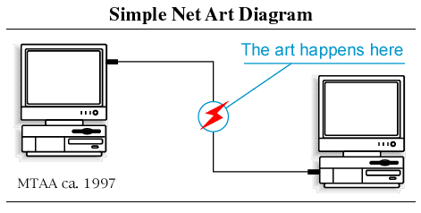

# Simple Net Art Diagram

[Simple Net Art Diagram, The Rhizome ArtBase](https://rhizome.org/art/artbase/artwork/simple-net-art-diagram/):
> Simple Net Art Diagram, a basic GIF animation of two computers connected by a line and a flashing red lightning bolt, has become an icon of early Net Art practices. One of MTAA's earliest and most recognized works, it concisely illustrates the nebulous region inhabited by online art.

## Source and Authors

- [MTAA-RR](http://www.mtaa.net/mtaaRR/off-line_art/snad.html), M.River & T.Whid Art Assoc.
- [SVG](./svg/Simple_Net_Art_Diagram.svg) added by [Garry Ing](https://garrying.com)

## License
This work is licensed under a [Creative Commons Attribution 2.5 License](https://creativecommons.org/licenses/by/2.5/legalcode).
